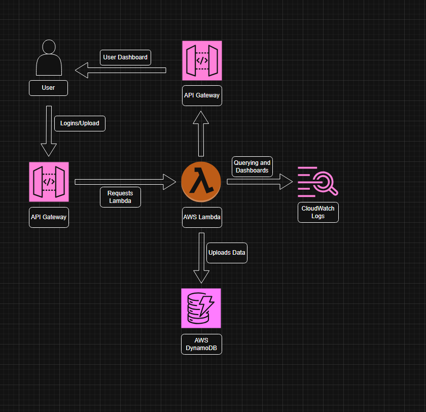

#  Real-Time User Activity Tracking & Observability System

##  Overview

This project is a **serverless event tracking system** built on AWS that captures user interactions (login, clicks, uploads) in real time and provides analytics and observability using CloudWatch.

---

##  Architecture

<p align="center">
  
</p>


---

##  Tech Stack

* AWS Lambda (Python) – Backend logic
* API Gateway (HTTP API) – API layer
* DynamoDB – NoSQL database for event storage
* CloudWatch – Logging, monitoring, dashboards
* HTML + CSS + JavaScript – Frontend dashboard


---

#  Implementation Guide

##  Step 1: Create DynamoDB Table

* Table Name: `user-activity`
* Partition Key: `user_id` (String)
* Sort Key: `timestamp` (String)
* Enable TTL:

  * Attribute: `ttl`

---

##  Step 2: Create IAM Role

* Service: Lambda
* Permissions:

  * AmazonDynamoDBFullAccess (for development)

---

##  Step 3: Create Lambda Functions

### 1. `track-user-activity` (POST)

* Receives user event
* Adds timestamp
* Stores data in DynamoDB
* Logs structured JSON to CloudWatch

---

### 2. `get-user-activity` (GET)

* Accepts `user_id` as query parameter
* Queries DynamoDB
* Returns latest user activity

---

##  Step 4: Configure API Gateway

Create HTTP API with routes:

* POST `/track` → `track-user-activity`
* GET `/get-user-activity` → `get-user-activity`

### Enable CORS:

* Allow Origin: `*`
* Allow Methods: GET, POST, OPTIONS
* Allow Headers: `*`

---

##  Step 5: Frontend Setup

### `index.html`

* Buttons:

  * Login
  * Click
  * Upload
* Sends POST request to `/track`

### `dashboard.html`

* Fetches data using `/get-user-activity`
* Displays:

  * Total logins
  * Uploads
  * Clicks
  * Recent activity list

---

##  Step 6: Add Structured Logging

Inside Lambda:

```python
print(json.dumps({
  "event_type": event_type,
  "user_id": user_id,
  "timestamp": timestamp,
  "status": "SUCCESS"
}))
```

---

##  Step 7: Use CloudWatch Logs Insights

Go to:
CloudWatch → Logs Insights → select Lambda log group

### Query: Event count by type

```sql
fields event_type
| stats count() by event_type
```

### Query: Activity over time

```sql
fields @timestamp
| stats count() by bin(5m)
```

---

##  Step 8: Create CloudWatch Dashboard

* Add Logs Insights widgets:

  * Event distribution
  * Traffic trends

---

# Sample Event Structure

```json
{
  "user_id": "user_123",
  "timestamp": "2026-04-05T19:00:00",
  "event_type": "login",
  "metadata": {
    "device": "mobile"
  }
}
```

---

# Features

* Real-time event tracking
* Scalable NoSQL storage
* API design
* Interactive frontend dashboard
* Observability with CloudWatch
* Log-based analytics

---

# Key Learnings

* Event-driven architecture
* DynamoDB data modeling
* API Gateway + Lambda integration
* Handling Decimal serialization issues
* Structured logging & log querying
* Building monitoring dashboards

---


# Conclusion

This project demonstrates how to build a **scalable, serverless, and observable system** for tracking and analyzing user behavior in real time.

---

